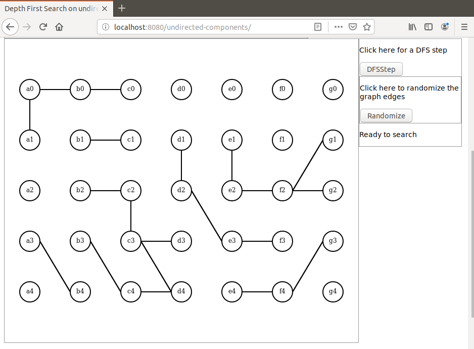
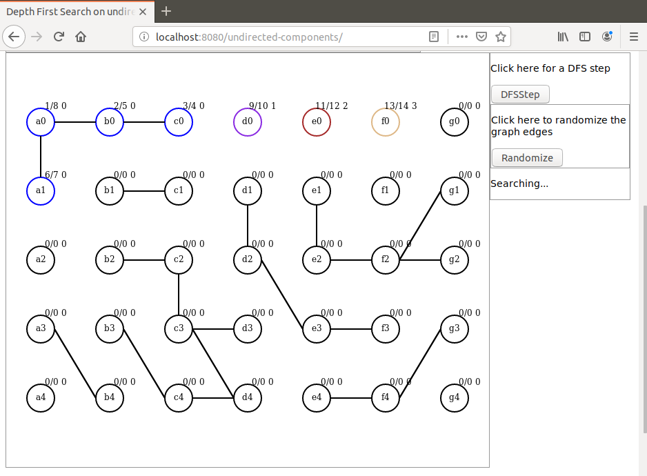
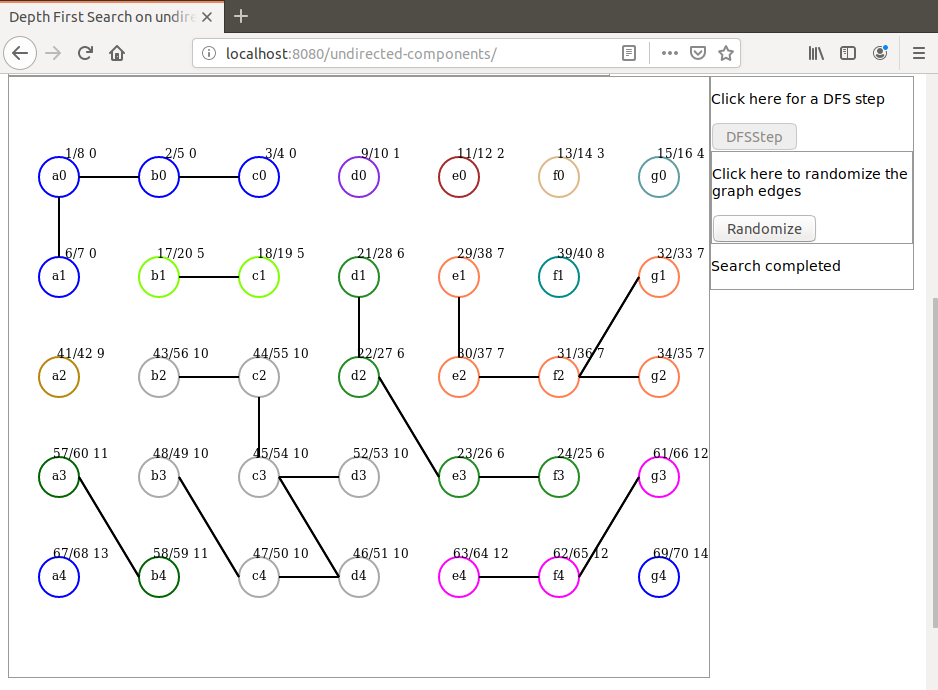

# depth-first-search-undir-step
I present here a Java based demonstration of the Depth First Search algorithm applied on an undirected graph.

The algorithm itself is implemented in Java. Javascript is used for initialization and display only.

The search itself is step-by-step, each Ajax request resulting in a new vertex discovery executed on server side.

An undirected graph is randomly created. Then the DFS algorithm is applied step-by-step.
For each vertex the DFS results are displayed with the format:
d/f c
where d is the discovery time, f is the finishing time and c is the number of the vertex connected component.
Each vertex is colored according to the component it belongs to. 

# Launchin the demo
To launch the demo run the command `mvn spring-boot:run` in project directory. When the application has started open q browsr and hit URL `localhost:8080/undirected-components`

Here are some screen shots that can be seen during the demo:

Initial graph:

Search step:

Search completed showing all components:

Dominique Ubersfeld, Cachan, France
